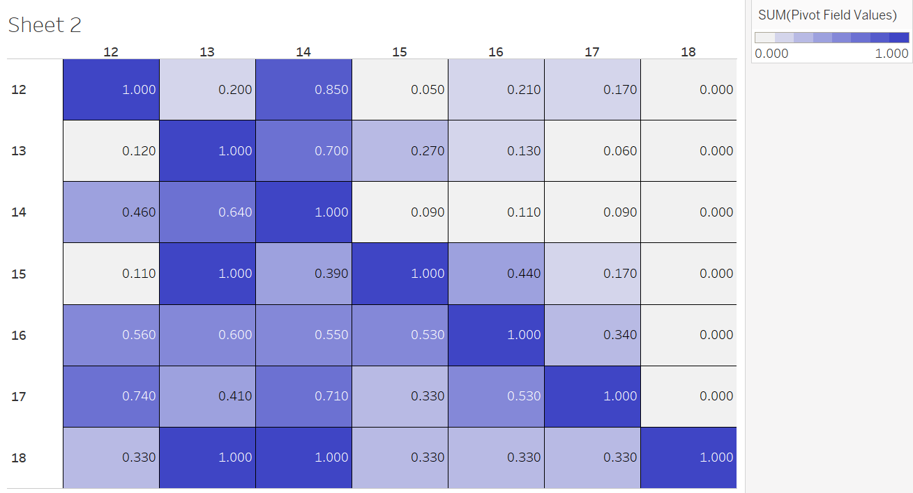

```{r setup, include=FALSE}
knitr::opts_chunk$set(echo = TRUE)
```

```{r warning=FALSE, message=FALSE}
library(tidyverse)
library(tidymodels)
library(lubridate)
options(scipen = 20)

theme_set(theme_light())
```

# **Import data**

* The attribute timestamp is convert to datetime by divide timestamp by 86400 and then add this result to **'1970-01-01'**

```{r warning=FALSE, message=FALSE}
front_end <- read_csv("data_round_2/Front-end dataset.csv") %>%
  mutate(date = as.POSIXct(timestamp/1e3, origin = "1970-01-01", tz = "UTC-7")) %>%
  select(-6, -7)

back_end <- read_csv("data_round_2/backend_dataset-2206.csv") %>%
  mutate(date = as.POSIXct(timestamp/1e3, origin = "1970-01-01", tz = "UTC-7"))

meta_data <- read_csv("data_round_2/Meta dataset.csv") %>%
  mutate(date = as.POSIXct(timeStampHash/1e3, origin = "1970-01-01", tz = "UTC-7"))

meta_data %>%
  select(bankCode) %>%
  unique()

names(front_end)
names(back_end)
```

# **Some analysis & Compared**

## **How many userid ?**

We have **13369** unique **id** in `front_end`. And compare to `back_end` only has **3950** unique userid. The `back_end` dataset record whenever user click `"Lien ket ngay"`

So, **9419** user only interact on UI and don't click to `"Lien ket ngay"`.

```{r warning=FALSE, message=FALSE}
front_end %>%
  count(id, sort = TRUE) %>%
  dim() 
```

```{r warning=FALSE, message=FALSE}
back_end %>%
  count(id, sort = TRUE) %>%
  dim()
```

## **Add type column**

* From the definition of new and old user that user using multiple screen like 12, 13, ... is new user and otherwise is old user. 

* So, I add new column `type` ("old" or "new") represent for this attribute.

Following step:

* First, I extract the users belong to `new type` by filter all row dot not have `screenid 11` and then add type `new` for all users in this relation.

* Second, from first step I have a list of new user, then I join this list with `front_end` dataset and add type `old` for all users do not have type value.

End up having two new relation:
* First is `user_type` containing unique `id` and their type,
* Second is `front_end_ui` that is similar to `front_end` except have new column `type`.

```{r warning=FALSE, message=FALSE}
new_user <- front_end %>%
  select(id, screenid) %>%
  unique() %>%
  filter(screenid != 11) %>%
  group_by(id) %>%
  summarise(type = "new") %>%
  ungroup()

front_end_ui <- front_end %>%
  left_join(new_user, by = "id") %>%
  mutate(type = ifelse(is.na(type), "old", type))

user_type <- front_end_ui %>%
  group_by(id, type) %>%
  summarize(n = n()) %>%
  select(-n) %>%
  ungroup()
```

## **Count number new user and old user**

```{r warning=FALSE, message=FALSE}
front_end_ui %>%
  group_by(id, type) %>%
  summarize(n = n(),
            retry = ifelse(n > 1, 1, 0)) %>%
  ungroup() %>%
  group_by(type) %>%
  summarize(n_ = n()) %>%
  gt::gt()
# front_end_ui %>%
#   group_by(id, type) %>%
#   summarize(n = n(),
#             retry = ifelse(n > 1, 1, 0)) %>%
#   ungroup() %>%
#   group_by(type, retry) %>%
#   summarize(n_ = n())
```

## **Count retry based on ID**

* The approach for this query is consider one user is `retry` or `not` by adding the label `retry` to each ID appear at least 2 times in `back_end` dataset and otherwise for each ID appear at least 1 time in `back_end`.

```{r warning=FALSE, message=FALSE}
back_end %>%
  left_join(user_type, by = "id") %>%
  filter(!is.na(type)) %>%
  group_by(id, type) %>%
  summarize(n = n()) %>%
  ungroup() %>%
  group_by(type) %>%
  summarize(retry = sum(n!=1),
            no_retry = sum(n==1)) %>%
  gt::gt()
```

## **Missing id in front end dataset**

* **1637** `ID` in `back_end` do not appear id in `front_end`

```{r warning=FALSE, message=FALSE}
back_end %>%
  left_join(user_type, by = "id") %>%
  filter(is.na(type)) %>%
  dim()
```

## **User have status B in backend**

Noting that the result in this chunk code is computing `retry based on id`.

* Fisrt, I list all users have status `B` at least 1 time. 

And we can see that **36/857** have status `B` more than 1 time.
```{r warning=FALSE, message=FALSE}
back_end %>%
  filter(stepresult == "B") %>%
  group_by(id, stepresult) %>%
  summarise(n = n()) %>%
  arrange(desc(n)) %>%
  head(10)
```

* Second, I list all user have status B only 1 time **821** records.

This result is reveal that all user starting at screen 11, and when failing in this screen the new user is transfer to new UI, otherwise still stayed at screen 11.

* So the `no_retry` for this case who have `B` status exactly 1 time is value of `0`. Because for new user they must retry at least 1 time to access the new UI. 

```{r warning=FALSE, message=FALSE}
user_one_B <- back_end %>%
  filter(stepresult == "B") %>%
  group_by(id, stepresult) %>%
  summarise(n = n()) %>%
  arrange(desc(n)) %>%
  filter(n == 1)

back_end %>%
  inner_join(user_one_B, by = "id") %>%
  left_join(user_type, by = "id") %>%
  filter(!is.na(type)) %>%
  group_by(id, type) %>%
  summarize(n = n()) %>%
  ungroup() %>%
  group_by(type) %>%
  summarize(retry = sum(n!=1),
            no_retry = sum(n==1)) %>%
  gt::gt()
```

## **Count retry based on sequence 00 and 01, no retry on sequence 0NULL**

* Total **retry** rate in `back_end` that meaning the number of times appear `00` and `01` in dataset `back_end`
```{r warning=FALSE, message=FALSE}
# total retry rate
back_end %>%
  mutate(encode = ifelse(stepresult == "B", 1, 0)) %>% 
  group_by(id) %>%
  arrange(date) %>% 
  mutate(next_code = lead(encode, order_by = id)) %>% 
  ungroup() %>% 
  filter(!is.na(next_code)) %>% 
  summarize(retry_rate = sum(encode == 0 & next_code == 0) + sum(encode == 0 & next_code == 1)) %>%
  gt::gt()

back_end %>%
  mutate(encode = ifelse(stepresult == "-FACJ", 0, 1)) %>% 
  group_by(id) %>%
  arrange(date) %>% 
  mutate(next_code = lead(encode, order_by = id)) %>% 
  ungroup() %>% 
  filter(!is.na(next_code), encode == 0) %>% dim()

back_end %>%
  inner_join(user_type, by = "id") %>%
  mutate(encode = ifelse(stepresult == "-FACJ", 0, 1)) %>% 
  arrange(id, date) %>% 
  group_by(id) %>% 
  mutate(next_code = lead(encode)) %>%
  filter(!is.na(next_code), encode == 0) %>% 
  group_by(type) %>%
  summarise(
    number_of_retry = n()
  ) %>% gt::gt()
# Retry
# 1 new     312
# 2 old     663
# 3 Total   975

back_end %>%
  mutate(encode = ifelse(stepresult == "-FACJ", 0, 1)) %>% 
  group_by(id) %>%
  arrange(date) %>% 
  mutate(next_code = lead(encode, order_by = id)) %>% 
  ungroup() %>% 
  filter(is.na(next_code), encode == 0) %>% dim()

back_end %>%
  inner_join(user_type, by = "id") %>%
  mutate(encode = ifelse(stepresult == "-FACJ", 0, 1)) %>% 
  arrange(id, date) %>% 
  group_by(id) %>% 
  mutate(next_code = lead(encode)) %>%
  ungroup() %>% 
  filter(is.na(next_code), encode == 0) %>% 
  group_by(type) %>%
  summarise( 
    number_of_no_retry = n()
  ) %>% gt::gt()

# No retry
# 1 new     311
# 2 old     673
# 3 Total   984

z_test_hypothesis(312, 663, 311, 673)
z_test_hypothesis(47, 157, 370, 1345)
z_test_hypothesis(663, 1336, 987, 4230)

back_end %>%
  inner_join(user_type, by = "id") %>%
  mutate(encode = ifelse(stepresult == "B", 1, 0)) %>% 
  group_by(id) %>%
  arrange(date) %>% 
  mutate(next_code = lead(encode, order_by = id)) %>% 
  ungroup() %>%
  filter(stepresult == "-FACJ", next_code == 1) %>%
  group_by(type) %>%
  summarise(
    n = n()
  )

back_end %>%
  inner_join(user_type, by = "id") %>%
  mutate(encode = ifelse(stepresult == "B", 1, 0)) %>% 
  group_by(id) %>%
  arrange(date) %>% 
  mutate(next_code = lead(encode, order_by = id)) %>% 
  ungroup() %>%
  filter(stepresult == "-FACJ", next_code == 1) %>%
  group_by(type) %>%
  summarise(
    n = n()
  )
# Retry: 1163 No_retry: 1450

back_end %>%
  inner_join(user_type, by = "id") %>%
  group_by(type) %>%
  summarise(n = n())
```

* **Retry** rate over `type` of user, this result lost some `id` compare to above result because some `id` in `back_end` do not appear in `front_end`.
```{r warning=FALSE, message=FALSE}
# retry rate over type
back_end %>%
  mutate(encode = ifelse(stepresult == "B", 1, 0)) %>%
  group_by(id) %>%
  arrange(date) %>%
  mutate(next_code = lead(encode, order_by = id)) %>%
  ungroup() %>%
  filter(!is.na(next_code)) %>%
  inner_join(user_type, by = "id") %>%
  group_by(type) %>%
  summarize(number_of_retry = sum(encode == 0 & next_code == 0) + sum(encode == 0 & next_code == 1)) %>%
  gt::gt()

```

* Total **no_retry** rate in `back_end` that meaning the number of times appear `0NULL` in dataset `back_end`.

```{r warning=FALSE, message=FALSE}
# no retry rate
back_end %>%
  mutate(encode = ifelse(stepresult == "B", 1, 0)) %>%
  group_by(id) %>%
  arrange(date) %>%
  mutate(next_code = lead(encode, order_by = id)) %>%
  ungroup() %>%
  summarize(number_of_no_retry = sum(encode == 0 & is.na(next_code))) %>%
  gt::gt()
```

* **No_retry** rate over `type` of user, this result lost some `id` compare to above result because some `id` in `back_end` do not appear in `front_end`.

```{r warning=FALSE, message=FALSE}
# no retry rate over type
back_end %>%
  mutate(encode = ifelse(stepresult == "B", 1, 0)) %>%
  group_by(id) %>%
  arrange(date) %>%
  mutate(next_code = lead(encode, order_by = id)) %>% 
  ungroup() %>%
  inner_join(user_type, by = "id") %>%
  group_by(type) %>%
  summarize(number_of_no_retry = sum(encode == 0 & is.na(next_code))) %>%
  gt::gt()
```

## **Hypotheses Testing for 2.7**

```{r warning=FALSE, message=FALSE}
matrx <- matrix(c(420, 1775, 567, 2455), ncol = 2, byrow = TRUE)
colnames(matrx) <- c("new", "old")
rownames(matrx) <- c("no_retry", "retry")
matrx

n1 <- 312+311
n2 <- 663+673
p1_hat <- 312/(567+420)
p2_hat <- 663/(2455+1775)

p_hat <- (n1*p1_hat + n2*p2_hat)/(n1+n2)

z_obs <- (p1_hat-p2_hat)/sqrt(p_hat*(1-p_hat)*(1/n1 + 1/n2))

# z_obs - qnorm(0.05)

pnorm(z_obs)

z_test_hypothesis(312, 663, 311, 673)
```

* With **p value = 0.37 > 0.05**, we can not reject the null hypotheses that **p1 = p2**

- That means the ratio of retry in the new UI is **no difference** to the old UI


## **Q3. Distribution of requests by the error**

### **With id who have B status**

We have **908** status B for **857** unique ID

```{r warning=FALSE, message=FALSE}
back_end %>% 
  filter(stepresult == "B") 
```

* And then we add a `type` for each user

* New has **61** times status B.

* Old has **624** times status B.

```{r warning=FALSE, message=FALSE}
back_end %>% 
  filter(stepresult == "B") %>%
  inner_join(user_type, by = "id") %>%
  group_by(type) %>%
  summarise(n = n()) %>%
  gt::gt()
```

### **With id who have other status**

We have **6631** status differ B for **3615** unique ID.

```{r warning=FALSE, message=FALSE}
back_end %>% 
  filter(stepresult != "B") %>%
  inner_join(user_type, by = "id") %>%
  group_by(type) %>%
  summarise(n = n()) %>%
  gt::gt()
```

And then we add a `type` for each user

* New has **987** times differ status B.

* Old has **4230** times differ status B.

### **Overall**

```{r warning=FALSE, message=FALSE}
back_end %>% 
  inner_join(user_type, by = "id") %>%
  count(stepresult, type) %>%
  gt::gt()
```

### **Q3. Hypotheses Testing for error rate**

*NULL Hypotheses: $H_0: p1 = p2$.

*Alternative Hypotheses: $H_1: p1 > p2$.

```{r warning=FALSE, message=FALSE}
n1 <- 61+512
n2 <- 405+2109
p1_hat <- (512)/(61+512)
p2_hat <- (2109)/(405+2109)
# sd1 <- sqrt(p1_hat*(1-p1_hat)/n1)
# sd2 <- sqrt(p2_hat*(1-p2_hat)/n2)

# quantile(rnorm(1000000, p1_hat, sd1), c(0.025, 0.975))
# quantile(rnorm(1000000, p2_hat, sd2), c(0.025, 0.975))
# df <- tibble(p = c(p1_hat, p2_hat),
#              P2.5 = c(0.9276, 0.8620),
#              P97.5 = c(0.9560, 0.8809),
#              type = c("NEW", "OLD"))
# 
# tib <- tibble(x1 = rnorm(1000000, p1_hat, sd1),
#               x2 = rnorm(1000000, p2_hat, sd2))
# 
# tib %>%
#   ggplot(aes(x = x1,))
# 
# df %>%
#   ggplot(aes(type, p, color = type)) +
#   geom_point(size = 1.5) +
#   geom_errorbar(aes(ymin = P2.5, ymax = P97.5)) +
#   geom_hline(yintercept=0.8809, linetype="dashed", color = "blue") +
#   expand_limits(y = 0.7)

p_hat <- (n1*p1_hat + n2*p2_hat)/(n1+n2)

z_obs <- (p1_hat-p2_hat)/sqrt(p_hat*(1-p_hat)*(1/n1 + 1/n2))

1-pnorm(z_obs)
```

* With **p_value = 5.7e-11 << 0.05**, we can reject the null hypotheses that **p1 = p2**
- That means the error rate of new UI is **higher than** the old UI with confidence level 95%.

## **Number of retry to get B status for overall user**

```{r warning=FALSE, message=FALSE}
B_status_backend <- back_end %>%
  filter(stepresult == "B") %>%
  group_by(id) %>%
  summarize(B_num = n())
```

```{r warning=FALSE, message=FALSE}
back_end %>%
  inner_join(B_status_backend) %>% 
  count(stepresult) %>%
  gt::gt()
```

With all of user have B status, they need **1071** times failure.

### **Number of retry to get B status for each type of user**

```{r warning=FALSE, message=FALSE}
back_end %>%
  inner_join(B_status_backend) %>% 
  inner_join(user_type) %>%
  count(stepresult, type) %>%
  gt::gt()
```

For **61** new user have B status, they need **145** failure to get B.
For **624** new user have B status, they need **778** failure to get B.

### **Hypotheses Testing for ratio of success over total try who got B for new and old UI**

*NULL Hypotheses: $H_0: p1 = p2$.

*Alternative Hypotheses: $H_1: p1 < p2$.

```{r warning=FALSE, message=FALSE}
n1 <- 61+145
n2 <- 624+778
p1_hat <- 61/n1
p2_hat <- 624/n2

p_hat <- (n1*p1_hat + n2*p2_hat)/(n1+n2)

z_obs <- (p1_hat-p2_hat)/sqrt(p_hat*(1-p_hat)*(1/n1 + 1/n2))

# abs(z_obs) - qnorm(0.95)
pnorm(z_obs)
```

* With **p_value = 2.7e-5 << 0.05**, we can reject the null hypotheses that **p1 = p2**
- That means the ratio of success over total try of who got B from new UI is **lower than** the old UI.

## **Q2a. Success rate among number of times retrived**

* First, we store ID of whom have retrived at least 1 time.

* Second, back_end join this list, and then continuously join with `user_type`

```{r warning=FALSE, message=FALSE}
user_retry <- back_end %>%
  mutate(encode = ifelse(stepresult == "B", 1, 0)) %>%
  group_by(id) %>%
  mutate(next_code = lead(encode, order_by = id)) %>%
  mutate(have_retrived = ((encode == 0 & next_code == 1) | 
                            (encode == 0 & next_code == 0))) %>%
  filter(have_retrived == TRUE) %>%
  select(id) %>%
  unique()

back_end %>%
  inner_join(user_retry, by = "id") %>%
  inner_join(user_type, by = "id") %>%
  count(stepresult, type) %>%
  gt::gt()
```

*NULL Hypotheses: $H_0: p1 = p2$.

*Alternative Hypotheses: $H_1: p1 < p2$.

```{r warning=FALSE, message=FALSE}
n1 <- 61+767
n2 <- 402+3288
p1_hat <- 61/n1
p2_hat <- 402/n2

p_hat <- (n1*p1_hat + n2*p2_hat)/(n1+n2)

z_obs <- (p1_hat-p2_hat)/sqrt(p_hat*(1-p_hat)*(1/n1 + 1/n2))

pnorm(z_obs)
```

* With **p_value = 0.001 < 0.05**, we can reject the null hypotheses that **p1 = p2**
- That means success rate among number of times retrived of who have retrived from new UI is **lower than** the old UI.

## **Q2. Success rate among who retrived**

**An solution**

* Hypotheses testing for An solution

*NULL Hypotheses: $H_0: p1 = p2$.

*Alternative Hypotheses: $H_1: p1 < p2$.

```{r warning=FALSE, message=FALSE}
n1 <- 59+419
n2 <- 465+2681
p1_hat <- 59/n1
p2_hat <- 465/n2

p_hat <- (n1*p1_hat + n2*p2_hat)/(n1+n2)

z_obs <- (p1_hat-p2_hat)/sqrt(p_hat*(1-p_hat)*(1/n1 + 1/n2))

pnorm(z_obs)
```

* With **p_value = 0.08 > 0.05**, we can reject the null hypotheses that **p1 = p2**

# **Analysis in eventid**

## **Overall eventid**

* **Top 6 highest appear frequently evenid**

This result is very reasonable because all of user need to use screen 11 first and for only new user when the action **Lien ket ngay** appear to fail, these users change to new screen 12->18.

```{r warning=FALSE, message=FALSE}
front_end_ui %>%
  count(eventid, sort = TRUE) %>%
  head(10) %>%
  gt::gt()
```

## **Overall eventid for new UI**

```{r warning=FALSE, message=FALSE}
front_end_ui %>%
  filter(screenid != "11") %>%
  count(eventid, type, sort = TRUE) %>%
  head(10) %>%
  gt::gt()
```

## **Calculate correlation between screenID**

That mean compute when screen X appear, probability screen Y appear.



## **Shrink front_end into form fitting date of back_end**

```{r warning=FALSE, message=FALSE}
front_end_fit_date <- front_end_ui %>%
  filter(date >= min(back_end$date), date <= max(back_end$date))

```

## **Q4**

```{r warning=FALSE, message=FALSE}
front_end %>%
  filter(eventid == "x,13.02") %>%
  dim()

user_eventid_13 <- front_end %>%
  group_by(id) %>%
  summarise(n_13 = sum(eventid == "x,13.02")) %>%
  filter(n_13 >= 1) 

user_eventid_14 <- front_end %>%
  group_by(id) %>%
  summarise(n_14 = sum(eventid == "x,14.05")) %>%
  filter(n_14 >= 1) 

user_eventid_13 %>%
  inner_join(user_eventid_14, by = "id") %>%
  dim()
```

## **Focus on number appear of eventid & predict which eventid is button LIEN KET NGAY**

```{r warning=FALSE, message=FALSE}
front_end_fit_date %>%
  group_by(id, screenid) %>%
  summarise(n = n()) %>%
  arrange(id) 

id_screenid <- front_end %>%
  group_by(id, screenid) %>%
  summarise(n = n()) %>% 
  arrange(id) 
  
B_status_backend_1 <- B_status_backend %>%
  mutate(B_status = rep(1, nrow(B_status_backend)))

id_screenid %>%
  left_join(B_status_backend_1, by = "id") %>%
  mutate(B_status = ifelse(is.na(B_status), 0, 1))

front_end %>%
  group_by(id) %>%
  arrange(date) %>%
  slice(n()) %>% 
  ungroup() %>%
  count(eventid, sort = TRUE)
```

# **Analysis on userid**

## **With 10 userid**

### **For all userid**

```{r warning=FALSE, message=FALSE}
back_end_list_user <- back_end %>%
  select(id) %>%
  unique()

top100_user_action <- front_end_ui %>%
  group_by(id) %>%
  summarise(n = n()) %>%
  arrange(desc(n)) %>%
  slice(1:1000)

top1000_user_action <- front_end_ui %>%
  group_by(id) %>%
  summarise(n = n()) %>%
  arrange(desc(n)) %>%
  slice(1:1000)

front_end_ui %>%
  group_by(id, type) %>%
  summarise(n = n()) %>%
  arrange(desc(n)) %>%
  ungroup() %>%
  slice(1:100) %>%
  count(type)
  
front_end_ui %>%
  group_by(id, screenid, type) %>%
  summarise(n = n()) %>%
  ungroup() %>%
  group_by(id) %>%
  mutate(n_overall = sum(n)) %>%
  arrange(desc(n_overall), desc(n)) 

top1000_user_action %>%
  inner_join(B_status_backend, by = "id")

front_end_ui %>%
  inner_join(back_end_list_user, by = "id") %>%
  group_by(id, screenid) %>%
  summarise(n = n()) %>%
  ungroup() %>%
  group_by(id) %>%
  mutate(n_overall = sum(n)) %>%
  arrange(desc(n_overall), desc(n)) 
```

### **For new userid**

```{r warning=FALSE, message=FALSE}
front_end_ui %>%
  filter(type == "new") %>%
  group_by(id) %>%
  summarise(n = n()) %>%
  ungroup() %>%
  group_by(id) %>%
  mutate(n_overall = sum(n)) %>%
  arrange(desc(n_overall), desc(n)) 
```

### **For old userid**

```{r warning=FALSE, message=FALSE}
front_end_ui %>%
  filter(type == "old") %>%
  group_by(id) %>%
  summarise(n = n()) %>%
  ungroup() %>%
  group_by(id) %>%
  mutate(n_overall = sum(n)) %>%
  arrange(desc(n_overall), desc(n)) 
```

# **Analysis on time-using by each user**

## **Average time of each user**

* First, I make a data frame called `time_diff` to contain the different second between 2 event of 1 user. And I consider 2 event gap more than 1 hours together. I consider 2 these events is seperated and don't count the time between them.

* The average time of each user using **UI** is **276 seconds**

```{r warning=FALSE, message=FALSE}
# second_diff <- front_end_ui %>%
#   group_by(id) %>%
#   summarise(date_diff = as.numeric(difftime(
#     strptime(max(date), format="%Y-%m-%d %H:%M:%S"),
#                            strptime(min(date), format="%Y-%m-%d %H:%M:%S"),
#                            units = "secs"))) %>% 
#   filter(date_diff <= 3600) %>%
#   ungroup() 

# second_diff %>%
#   summarise(avg = sum(date_diff)/n())

time_diff <- front_end %>%
  arrange(date) %>%
  group_by(id) %>%
  mutate(next_date = lead(date),
         time_diff = as.numeric(difftime(
    strptime(next_date, format="%Y-%m-%d %H:%M:%S"),
                           strptime(date, format="%Y-%m-%d %H:%M:%S"),
                           units = "secs"))) %>%
  filter(time_diff <= 3600) %>%
  ungroup() 

time_diff_2 <- front_end %>%
  arrange(date) %>%
  group_by(id) %>%
  mutate(next_date = lead(date),
         time_diff = as.numeric(difftime(
    strptime(next_date, format="%Y-%m-%d %H:%M:%S"),
                           strptime(date, format="%Y-%m-%d %H:%M:%S"),
                           units = "secs"))) %>%
  count(time_diff > 3600)
  ungroup() 

time_diff %>%
  summarise(avg = sum(time_diff)/13369) %>%
  gt::gt()
```

## **Average time on each UI**

`time_userid` containing the total time using **UI** of each user.

```{r warning=FALSE, message=FALSE}
time_userid <- time_diff %>%
  select(id, time_diff) %>%
  group_by(id) %>%
  summarise(time = sum(time_diff))

time_userid %>%
  inner_join(user_type, by = "id") %>%
  group_by(type) %>%
  summarize(avg_time = sum(time)/n()) %>%
  gt::gt()
```

## **Average time of users have B status and users have no B status**

```{r warning=FALSE, message=FALSE}
time_userid %>%
  inner_join(back_end_list_user, by = "id") %>%
  left_join(B_status_backend, by = "id") %>%
  mutate(B_num = ifelse(is.na(B_num), 0, 1)) %>%
  group_by(B_num) %>%
  summarise(avg_time = sum(time)/n()) %>%
  gt::gt()
  
```

## **Find userid do not have B status but using UI over average time of people who not have B status** 

### **Get userid**

```{r warning=FALSE, message=FALSE}
front_end_user_id <- front_end %>%
  select(id) %>%
  unique()

time_userid %>%
  filter(time >= 566) %>%
  inner_join(user_retry, by = "id") %>%
  left_join(B_status_backend, by = "id") %>%
  inner_join(front_end_user_id, by = "id") %>%
  inner_join(user_type, by = "id") %>%
  filter(is.na(B_num)) %>%
  arrange(desc(time))
```

### **Count new and old**

```{r warning=FALSE, message=FALSE}
time_userid %>%
  filter(time >= 566) %>%
  inner_join(user_retry, by = "id") %>%
  left_join(B_status_backend, by = "id") %>%
  inner_join(front_end_user_id, by = "id") %>%
  inner_join(user_type, by = "id") %>%
  filter(is.na(B_num)) %>%
  count(type) %>%
  gt::gt()
```

## **Investigate of some userid**

```{r warning=FALSE, message=FALSE}
front_end_ui %>%
  filter(id == "IHFIAGHEHDIIAHJCAIB") %>%
  count(eventid, sort = TRUE)
```

## **For each UI, determine the average time it takes from “-FACJ” status to “B” status.**

```{r}
back_end %>%
  group_by(id) %>%
  arrange(date) %>%
  mutate(next_date = lead(date),
         time_diff = as.numeric(difftime(
    strptime(next_date, format="%Y-%m-%d %H:%M:%S"),
                           strptime(date, format="%Y-%m-%d %H:%M:%S"),
                           units = "secs"))) 
```

## **Avg**

```{r warning=FALSE, message=FALSE}
time_userid %>%
  ggplot(aes(x = time+1)) +
  geom_histogram(bins = 30) +
  scale_x_log10()

time_userid %>%
  inner_join(user_type, by = "id") %>%
  ggplot(aes(x = time, fill = factor(type))) +
  geom_histogram(bins = 30)


```

## **Average time using ScreenID**

```{r}
time_diff %>%
  group_by(screenid) %>%
  summarise(n = n(),
    avg_time = sum(time_diff)/n()) %>%
  arrange(desc(n))%>%
  ggplot(aes(x = fct_reorder(factor(screenid), avg_time), y = avg_time, fill = n)) +
  geom_col() +
  coord_flip()

back_end_ui_GMT_07 <- back_end %>% 
  left_join(user_type, by = "id") %>%
  arrange(date)

k_mean_clus <- back_end %>%
  mutate(encode = ifelse(stepresult == "B", 1, 0)) %>% 
  group_by(id) %>%
  arrange(date) %>% 
  mutate(next_code = lead(encode, order_by = id)) %>% 
  ungroup() %>%
  filter(!is.na(next_code)) %>%
  group_by(id) %>%
  summarize(retry_rate = sum(encode == 0 & next_code == 0) + sum(encode == 0 & next_code == 1)) %>% 
  left_join(B_status_backend, by = "id") %>%
  mutate(B_num = ifelse(is.na(B_num), 0, B_num))

library(cluster)
library(fpc)
k_mean_clus_trans <- k_mean_clus %>%
  mutate(retry_rate = log10(retry_rate+1),
         B_num = log10(B_num+1))
clus <- kmeans(k_mean_clus_trans[,-1], centers=3)
plotcluster(k_mean_clus_trans[,-1], clus$cluster)
# More complex
clusplot(k_mean_clus[,-1], clus$cluster, color=TRUE, shade=TRUE, 
         labels=2, lines=0)

k_mean_clus %>%
  inner_join(user_type, by = "id") %>%
  ggplot(aes(x = retry_rate, y = B_num, col = type)) +
  geom_point(size = 4)

front_end %>%
  mutate(weekday = weekdays(date)) %>% View()

front_end %>%
  filter(as.Date(format(date, "%Y-%m-%d")) == "2021-03-15" |
         as.Date(format(date, "%Y-%m-%d")) == "2021-03-16") %>% 
  dim()

front_end %>%
  filter(as.Date(format(date, "%Y-%m-%d")) == "2021-03-16") %>% 
  select(id) %>%
  unique() %>% dim()
```


